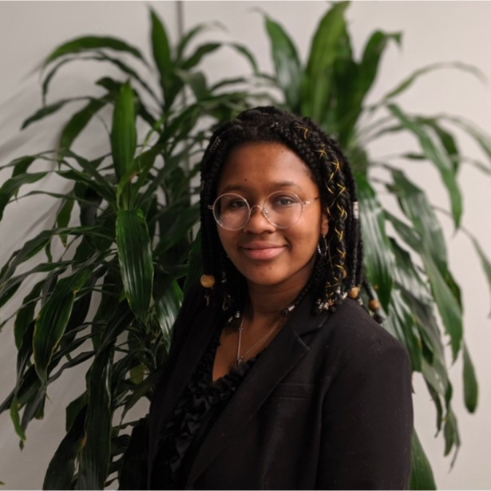
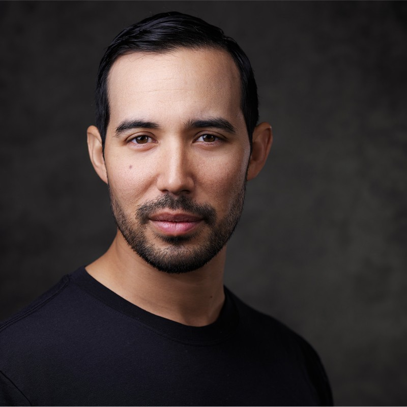

# **What A Day**

## **Description**

A terminal based choose your own adventure story. The choices you make will determine your day. Choose wisely!

        terminal command: npx i what-a-day

## **About the Project**

This project was developed in a one week sprint using NodeJs, Express, Inquirer, and SQL. Inquirer provides a user interface in the terminal that allows users to interact with the story, while story data is retrieved from the database using Express and SQL.

## **About the Developers**

### | [**Emily Sellers**](https://www.linkedin.com/in/emilymsellers/) |

Emily is a software developer in Portland, OR. She has a diverse background in family support and mental health nonprofits. Her favorite adventures involve playing in the mountains or on the coast with her two young daughters.

### | [**Morgan Niemeyer**](https://www.linkedin.com/in/morganniemeyer/) |

Morgan is a fullstack developer from Minneapolis, MN. She has a long background including over a decade in event management. Her favorite adventures tend to be more indoors based with conventions, video games, and well made food.

### | [**Lexus Banton**](https://www.linkedin.com/in/lexcancode/) |

Lexus is a software developer based in Wilmington, DE. Her favorite Adventures involve pretty sights, great food, and travel, preferably far from home.

### | [**Andrew Boyle**](https://www.linkedin.com/in/andrewjamesboyle/) |

Andrew is a full-stack software developer based in Hood River, OR. His favorite adventures usually include some combination of mountains, bikes, and his 1 year old daughter.